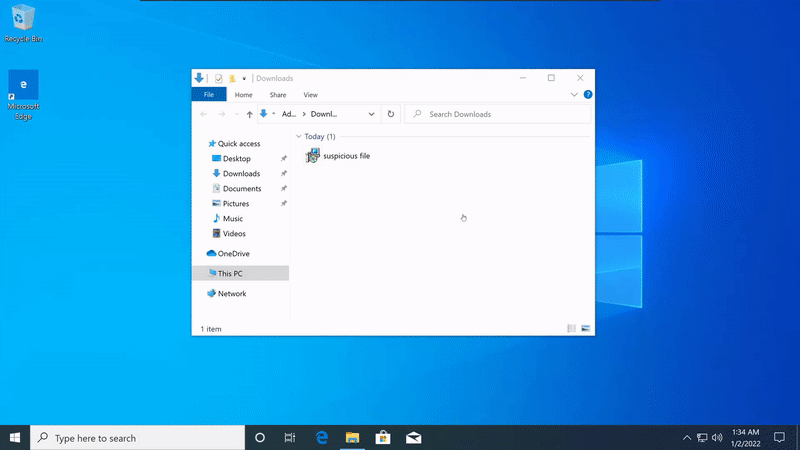

# Quickly lookup any file on VirusTotal using right-click context menu

## Preview:


## Requirements:
* Windows PowerShell (built into Windows)

## Installation:
1. Download or clone the repository.
2. Right-click `Install-ContextMenu.ps1` and select "Run with PowerShell"
   - If you get an execution policy error, run PowerShell as Administrator and execute:
     ```powershell
     Set-ExecutionPolicy -ExecutionPolicy RemoteSigned -Scope CurrentUser
     ```
3. Right-click any file and select "Check on VirusTotal"

## Uninstallation:
Right-click `Uninstall-ContextMenu.ps1` and select "Run with PowerShell"

## How it works:
1. Calculates SHA256 hash of the selected file
2. Opens VirusTotal in your default browser with the file hash
3. No file is uploaded - only the hash is used for lookup
